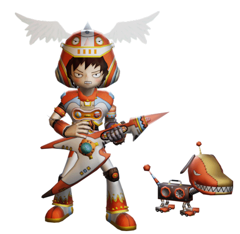

# Gitaroo Man (PS2, 2001)

* **imx.py** - Converts IMX image files to PNG.
  * Prerequisites: [PyPNG](https://pypi.org/project/pypng/)
* **xg.py** - Converts an XG model to OBJ or FBX. Textures must be converted separately using `imx.py`.
  * Prerequisites: [FBX Python SDK](https://www.autodesk.com/products/fbx/overview)
* **xgmextract.py** - Extracts files from an XGM archive.

