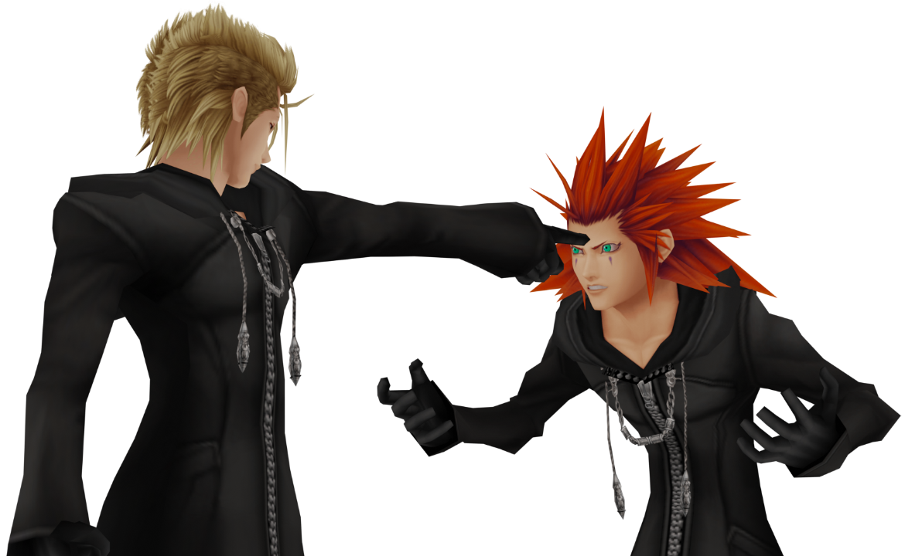

# Kingdom Hearts II Final Mix (PS2, 2007)

* **io_kh2fm** - A *super-experimental* Blender add-on capable of importing MDLX (model) and ANB/MSET (animation) files. To install, build dependencies using `cmake`, pack the contents of `Blender/addons/io_kh2fm/` in a ZIP file and import the add-on using `Edit -> Preferences -> Add-ons -> Install`. Compatible with Blender 2.8.x only.

