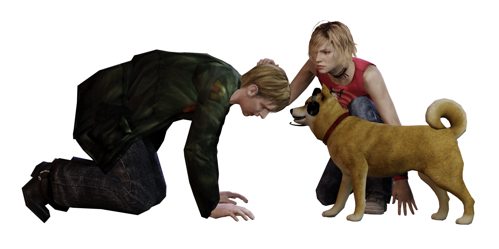

# Silent Hill 2 (PS2, 2001), Silent Hill 3 (PS2, 2003)

* **afsextract.py** - (SH3) Extracts files from an .AFS archive (audio, cutscene data).
* **mfaextract.py** - (SH3) Extracts files from an .MFA archive (game resources).
* **io_sh2_sh3** - A Blender add-on capable of importing MDL (model), ANM (animation), and DDS/PACK (cutscene animation) files. Compatible with Blender 2.8.x only. To install:
  * Build `PS2/Common/gsutil` by configuring and building `cmake` from the root directory of this repository (requires [SWIG](https://swig.org)). When compiling, ensure you are using the same Python version that comes with Blender. Otherwise, the compiled library will fail to import. You can check the Python version you need by viewing the console in the Scripting workspace in Blender.
  * Pack the contents of `Blender/addons/io_sh2_sh3/` in a ZIP file. Ensure that the contents of folders `gsutil/` and `readutil/` are included in the ZIP as well.
  * Import the add-on using `Edit -> Preferences -> Add-ons -> Install`.

## Known Issues
  * Blender may garbage collect textures if they are not displayed in the UI for some time, causing materials to appear black.
  * SH2: .DDS character position keyframes in the scene are incorrect.
  * SH2: Face animations are not yet supported (these are stored in .CLS files).
  * SH3: Some .MDL files fail to import textures (e.g. models in the `it/` folder).

